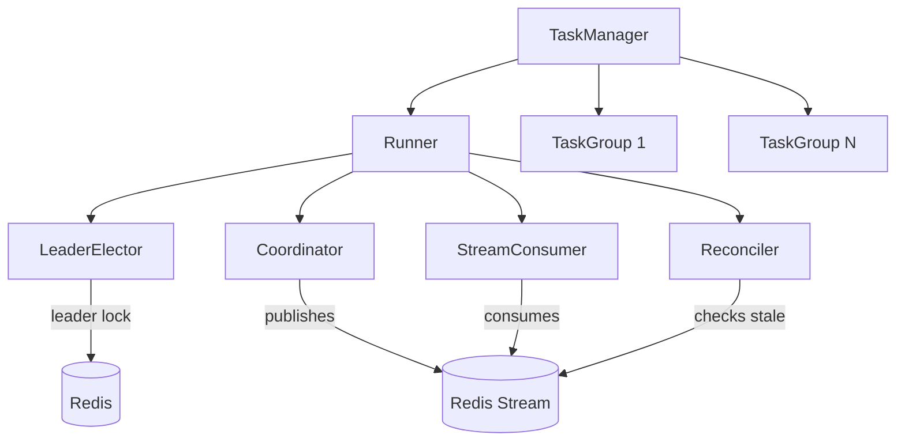
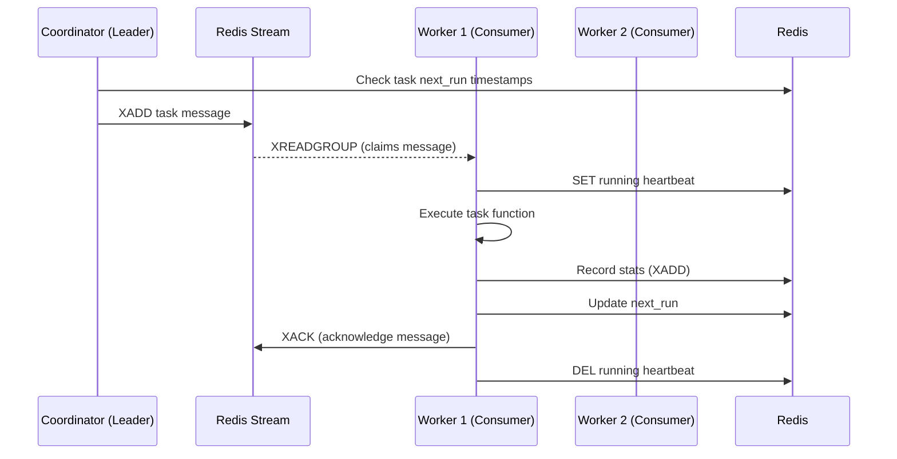

# Architecture

FastAPI Task Manager uses a Redis Streams-based architecture with leader election to provide distributed, fault-tolerant task scheduling.

---

## Component Overview

The library follows a hierarchical structure: **TaskManager** -> **TaskGroup** -> **Task**

---

## Core Components

### TaskManager

The entry point that integrates with FastAPI's lifespan. It creates the Redis connection, spawns the Runner, and provides the API router via `get_manager_router()`. On startup, it also loads any dynamic tasks persisted in Redis.

### TaskGroup

Organizes related tasks. Tasks are registered via the `@task_group.add_task(cron_expr)` decorator. Supports multiple cron expressions and kwargs per task function. Also provides `@task_group.register_function()` for the dynamic task system.

### Runner

Orchestrates all stream mode components: LeaderElector, Coordinator, StreamConsumer, and Reconciler. Manages the worker lifecycle and coordinates graceful shutdown.

### LeaderElector

Distributed leader election via Redis. Uses a lock key with TTL and periodic heartbeat renewal. Only the leader instance runs the Coordinator and Reconciler; all instances run the StreamConsumer.

### Coordinator

Runs on the leader only. Determines which tasks are due based on their cron expressions and `next_run` timestamps, then publishes task messages to the Redis Stream.

### StreamConsumer

Runs on all instances. Consumes task messages from the Redis Stream using consumer groups (`XREADGROUP`). This distributes execution across all workers while ensuring each task is processed exactly once.

### Reconciler

Runs on the leader only. Periodically scans for:

- **Overdue tasks**: tasks whose `next_run` has passed but were not scheduled (e.g. due to a leader failover)
- **Stale pending messages**: messages claimed by a consumer but not acknowledged within the timeout (e.g. worker crash)

Detected issues are resolved by republishing tasks or reclaiming pending messages.

---

## Execution Flow

1. The **Coordinator** (leader only) checks which tasks are due and publishes them to the Redis Stream
2. **StreamConsumers** on all instances read from the stream via consumer groups
3. The worker sets a **running heartbeat** key, executes the task, records statistics, and acknowledges the message
4. If a worker crashes, the heartbeat expires and the **Reconciler** reclaims the pending message

---

## Fault Tolerance

### Leader Failover

If the leader crashes, its lock expires after `leader_heartbeat_interval * 3` seconds. Another instance acquires leadership and resumes scheduling. The Reconciler detects any tasks that were missed during the failover window.

### Worker Crash Recovery

Each executing task maintains a heartbeat key in Redis with a short TTL. If a worker crashes:

1. The heartbeat key expires (after `running_heartbeat_interval * 3` seconds)
2. The Reconciler detects the pending message has been idle too long
3. The message is reclaimed and re-executed by another worker

### Exponential Backoff

When a task fails, the system applies exponential backoff: the next retry is delayed by `retry_backoff * retry_backoff_multiplier ^ (failures - 1)`, capped at `retry_backoff_max`. This prevents rapid failure loops. Backoff state can be reset via the `POST /tasks/reset-retry` API endpoint.
